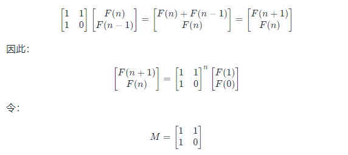

# 010- I. 斐波那契数列

写一个函数，输入 n ，求斐波那契（Fibonacci）数列的第 n 项（即 F(N)）。斐波那契数列的定义如下：

```bigquery
F(0) = 0,   F(1) = 1
F(N) = F(N - 1) + F(N - 2), N > 1.
```

斐波那契数列由 0 和 1 开始，之后的斐波那契数就是由之前的两数相加而得出。

答案需要取模 1e9+7（1000000007），如计算初始结果为：1000000008，请返回 1。

## 示例

示例 1：

```bigquery
Input: n = 2
Output: 1
```

示例 2：

```bigquery
Input: n = 5
Output: 5
```

## 方案V0：动态规划

### 思路及算法

斐波那契数的边界条件是 F(0)=0F(0)=0 和 F(1)=1F(1)=1。当 n>1n>1 时，每一项的和都等于前两项的和，因此有如下递推关系：

F(n)=F(n-1)+F(n-2)
F(n)=F(n−1)+F(n−2)

由于斐波那契数存在递推关系，因此可以使用动态规划求解。动态规划的状态转移方程即为上述递推关系，边界条件为 F(0) 和 F(1)。

根据状态转移方程和边界条件，可以得到时间复杂度和空间复杂度都是 O(n) 的实现。由于 F(n) 只和 F(n-1) 与 F(n-2) 有关，因此可以使用「滚动数组思想」把空间复杂度优化成 O(1)。如下的代码中给出的就是这种实现。

计算过程中，答案需要取模 1e9+7。

### 代码

```go
func fib0(n int) int {
	const mod int = 1e9 + 7
	if n < 2 {
		return n
	}
	p, q, r := 0, 0, 1
	for i := 2; i <= n; i++ {
		p = q
		q = r
		r = (p + q) % mod
	}
	return r
}
```

### 复杂度分析

- 时间复杂度：O(n)。
- 空间复杂度：O(1)。

## 方案V1：矩阵快速幂

### 思路及算法

方法一的时间复杂度是 O(n)。使用矩阵快速幂的方法可以降低时间复杂度。

首先我们可以构建这样一个递推关系：



因此只要我们能快速计算矩阵 M 的 n 次幂，就可以得到 F(n) 的值。如果直接求取 M^n ，时间复杂度是 O(n)，可以定义矩阵乘法，然后用快速幂算法来加速这里 M^n
的求取。

计算过程中，答案需要取模 1e9+7。


### 代码

```go
const mod int = 1e9 + 7

type matrix [2][2]int

func multiply(a, b matrix) (c matrix) {
	for i := 0; i < 2; i++ {
		for j := 0; j < 2; j++ {
			c[i][j] = (a[i][0] * b[0][j] + a[i][1] * b[1][j]) % mod
		}
	}
	return
}

func pow(a matrix, n int) matrix{
	ret := matrix{{1,0}, {0, 1}}
	for ; n > 0; n>>=1 {
		if n&1 == 1{
			ret = multiply(ret, a)
		}
		a = multiply(a, a)
	}
	return ret
}

func fib1(n int) int {
	if n < 2 {
		return n
	}
	res := pow(matrix{{1, 1}, {1, 0}}, n - 1)
	return res[0][0]
}
```

### 复杂度分析

- 时间复杂度：O(log n)。
- 空间复杂度：O(1)。